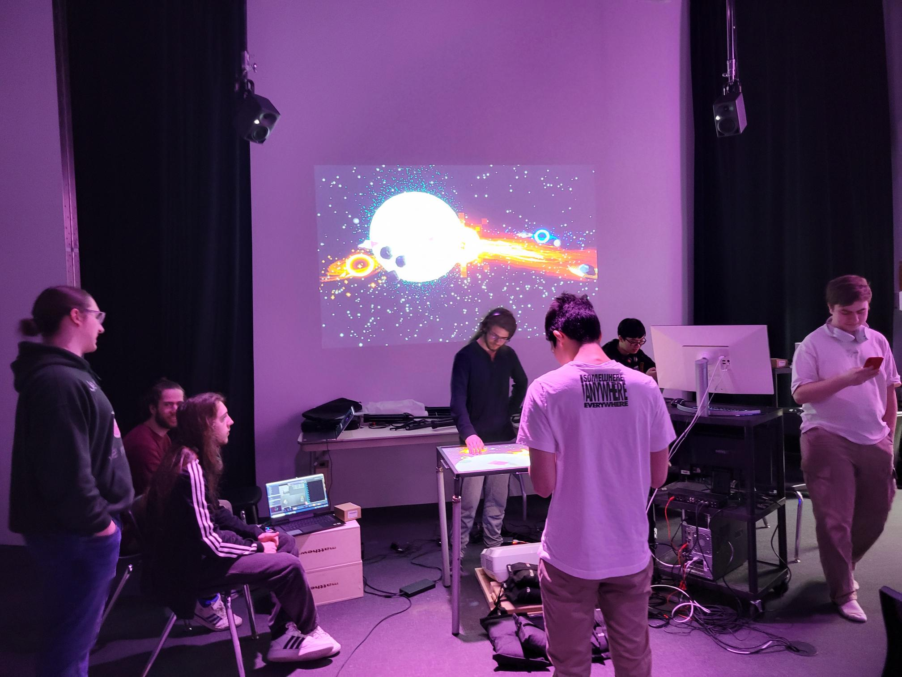

## CANEVAS COSMIQUE

Le canevas cosmique est l'un des projets présentés dans l'exposition CRESCENTIA qui a pris place dans les studios du collège montomrecy.

Cette exposition temporaire intérieure a été réalisé par Jacob Alarie-Brousseau,Étienne Charron,Jérémy Cholette,Quoc Huy Do,Mikaël Tourangeau en 2024.

Crescentia qui signifie «croissance» est étoitement lié au projet du canevas cosmique. 

En effet, ce projet qui met en scène l'univers, démontre l'effet de croissance infinie de celui-ci.

De plus, le compteur d'itérations qui affiche le nombre de fois ou l'univers fût détruit puis reveint à la vie propose une fois de plus une façon unique de démonter la croissance continuelle de l'univers.

Lors de cette visite du 20 mars, j'ai pu tester cette installation interactive qui, avec des statues munies de codes sur leur face inférieur, permet de déplacer des planetes qui intéragissent entre elles.

