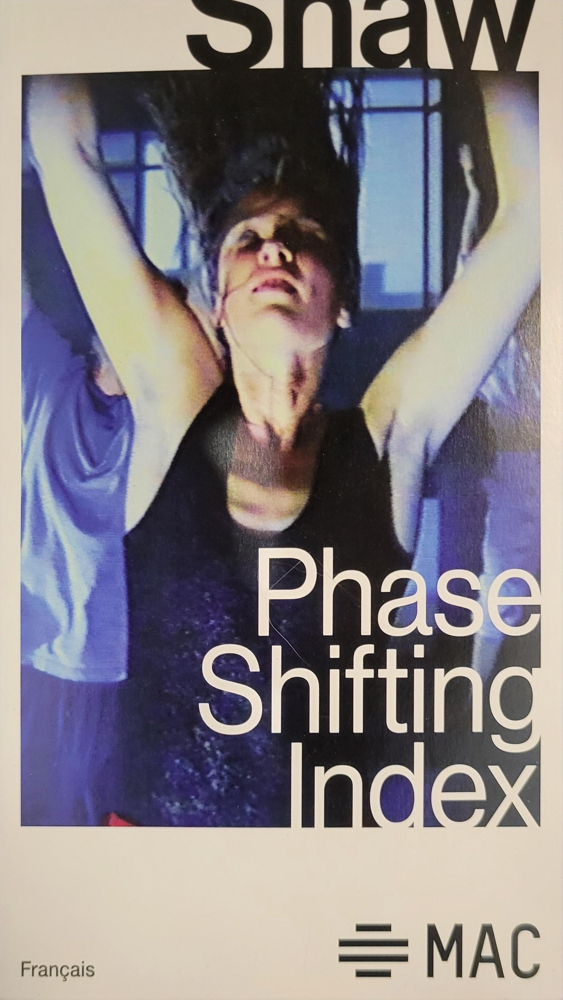
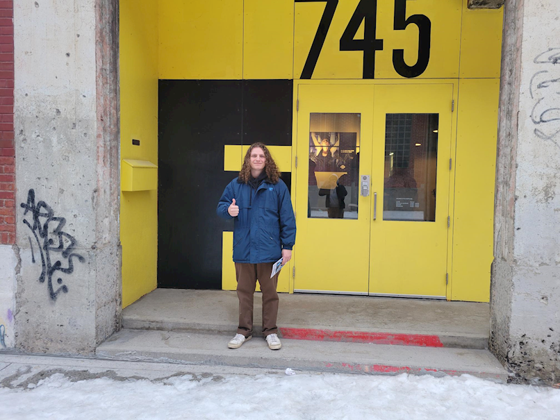
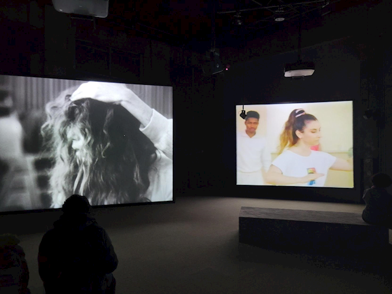
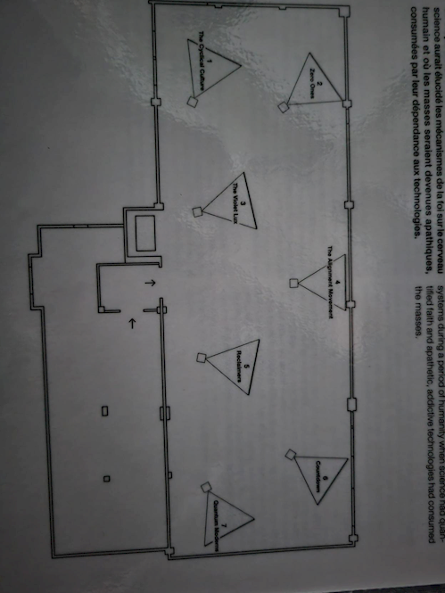
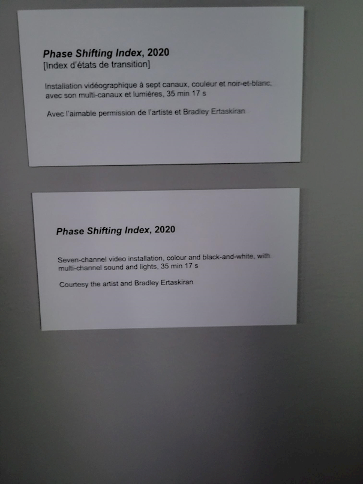
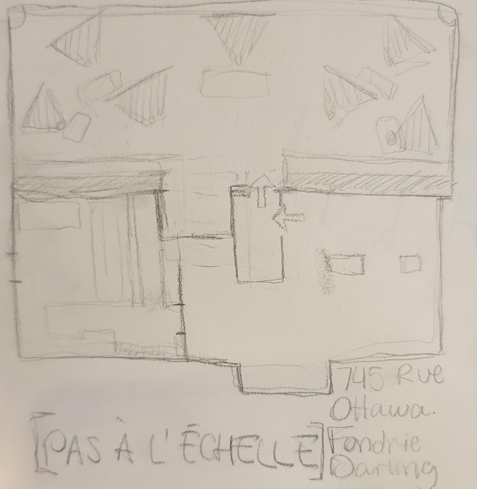
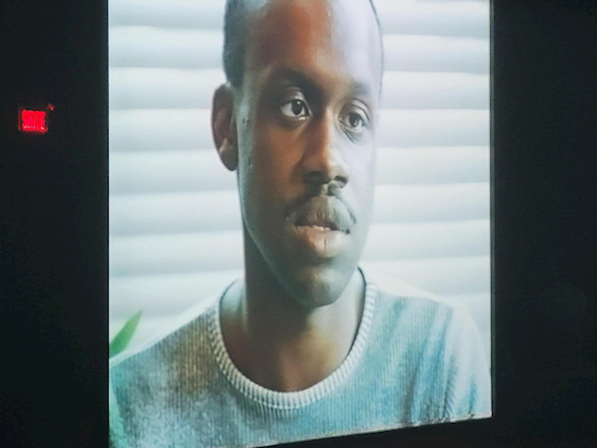
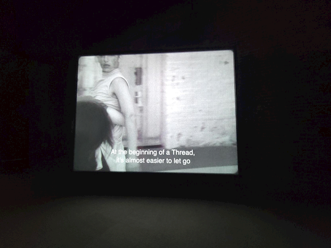

# [EXPOSITION PHASE SHIFTING INDEX de JEREMY SHAW]

# Nom de l'exposition

## Phase shifting index : par Jeremy Shaw

 
# Lieu de mise en exposition

 ## Fondrie Darling

 
 
# Type d'exposition 

## Temporaire intérieure
 
# Date de votre visite

## 31 Janvier 2024
 
# Titre de l'oeuvre

## Phase Shifting Index par Jeremy Shaw

 
# Année de réalisation

## 2020
 
# Description de l'oeuvre

## (Selon le cartel présent à l'exposition)

## Phase Shifting Index est une <installation vidéographique à sept canaux, couleur et noir-et-blanc,avec son multi-canaux et lumières de 35min 17s>

### La pièce est divisée en deux. Premièrement, une salle ou les spectateurs attendent la fin de la boucle précédente et/ou se font expliquer l'oeuvre par le guide. Deuxièmement, la salle d'exposition qui est totalement recouverte de tapis. Il y a plusieurs endroit ou s'assir comme des estrades positionné sur le mur le plus proche de l'entrée et des bancs positionnés dans le milieu et sur les côtés de la salle.

 
# Type d'installation

## Contemplatif, Immersif et Interactif

https://github.com/AlexandreGendronCM/H24_V11_inspirations_GENDRON/assets/143230188/90cd8d57-4a15-45a5-821a-c4d6b3d104ac

 
## Composantes et techniques

Cette oeuvre nécéssite l'utilisation de haut-parleurs accrochés au plafond et des subwoofers (haut parleurs de basses fréquences) cachés dans l'ombre derrière les écrans du fond.
Il faut aussi 7 projecteurs pour diffuser les viéos sur les écrans.

 
## Éléments nécessaires à la mise en exposition
 
## Expérience vécue

## 
 
## Ce qui vous a plu, vous a donné des idées

### Le tapis

### Le son

### La lumière
 
## Aspect que vous ne souhaiteriez pas retenir pour vos propres créations ou que vous feriez autrement
