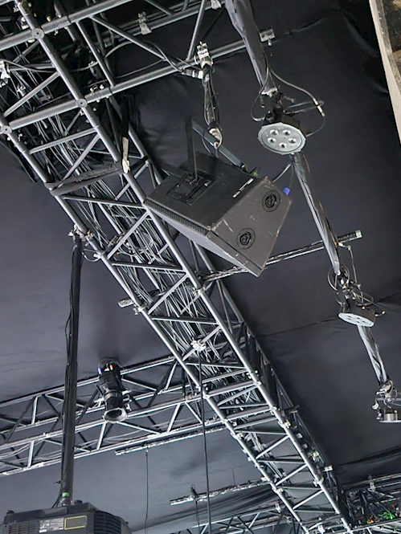

# [EXPOSITION PHASE SHIFTING INDEX de JEREMY SHAW]

# Nom de l'exposition ✏

## Phase shifting index : par Jeremy Shaw

 
# Lieu de mise en exposition

 ## Fondrie Darling

 
 
# Type d'exposition 

## Temporaire intérieure
 
# Date de votre visite

## 31 Janvier 2024
 
# Titre de l'oeuvre 📜

## Phase Shifting Index par Jeremy Shaw

 
# Année de réalisation

## 2020
 
# Description de l'oeuvre 📜

## (Selon le cartel présent à l'exposition)

## Phase Shifting Index est une <installation vidéographique à sept canaux, couleur et noir-et-blanc,avec son multi-canaux et lumières de 35min 17s>

### La pièce est divisée en deux. Premièrement, une salle ou les spectateurs attendent la fin de la boucle précédente et/ou se font expliquer l'oeuvre par le guide. Deuxièmement, la salle d'exposition qui est totalement recouverte de tapis. Il y a plusieurs endroit ou s'assir comme des estrades positionné sur le mur le plus proche de l'entrée et des bancs positionnés dans le milieu et sur les côtés de la salle.

 
# Type d'installation

## Contemplatif, Immersif et Interactif

https://github.com/AlexandreGendronCM/H24_V11_inspirations_GENDRON/assets/143230188/90cd8d57-4a15-45a5-821a-c4d6b3d104ac

 
## Composantes et techniques ⚙

### Étant donné que l'oeuvre est principalement numérique. J'assume que les seuls éléments qui sont transportés sont le tapis, ou du moins un échantillon afin de se procurer une  quantité appropriée pour chaque salle, et les écrans.

En effet je crois que les salons d'expositions peuvent se procurer les mêmes modèles d'haut parleurs, subwoofer et projecteur afin d'assurer l'authenticité de l'oeuvre, mais il est possible que l'artiste ait fourni ce matériel pour être certain d'avoir le bon équipement.

### Les lumières et le filage n'est très probablement pas fourni, car ces éléments sont trop dépendants de la salle dans laquelle l'exposition prend place, tout comme le matériel requis pour attacher les écrans au plafond. 

 
## Éléments nécessaires à la mise en exposition ⚙

### Cette oeuvre nécéssite l'utilisation de haut-parleurs accrochés au plafond et des subwoofers (haut parleurs de basses fréquences) cachés dans l'ombre derrière les écrans du fond.
### Il faut aussi 7 projecteurs pour diffuser les viéos sur les écrans.

 
## Expérience vécue 👀✨

### L'expérience que j'ai vécu en assistant à l'exposition temporaire intérieure «Phase Shifting Index» de Jeremy Shaw est plutôt particulière. En effet, la combinaison de confusion et curiosité qui envahit la salle pendant que les 7 vidéos qui ne semblent avoir aucun rapport entre elles est fascinant.

### L'oeuvre met en place un environement favorable à l'interactivité, car le sol et les places assises sont recouvertes de tapis, qui stimule le toucher, et la salle est remplie par le son des 7 vidéos et par la lumière dynamique.

### De plus, les subwoofers font une vibration qui se ressentent partout dans la salle

### En entrant dans la salle principale, les spectateurs sont libre de se déplacer comme ils le veulent. Cependant ils sont invités à prendre place dans les estrades qui offrent une vue plus globale de l'oeuvre ou sur un banc qui offre une expérience plus intime et immersive à cause de leur proximité avec les lumières et les écrans.

### Finalement, lorsque les vidéos commencent à se sychroniser, les lumières changent, les subwoofers s'activent et les spectateurs deviennent silencieux. Personellement, j'était très confus, car cette transition est soudaine. En effet, les vidéos se synchonisent et puis changent completement, laissant l'audiance dans l'incompréhension et la surprise.

 
## Ce qui vous a plu, vous a donné des idées ❤

### J'ai particulièrement aimé l'utilisation de tapis dans l'oeuvre «Phase Shifting Index». En effet, j'ai trouvé que le tapis à permis un confort accru ce qui m'a permis de vivre l'ouvre dans un confort optimal et d'avoir une expérience beaucoup plus interactive étant donné que le sens du toucher était lui aussi stimulé.
 
## Aspect que vous ne souhaiteriez pas retenir pour vos propres créations ou que vous feriez autrement 😒

### Il n'y a aucun aspect qui m'a particulièrement déplu, cependant je crois que la salle d'attente pourrait être plus insonorisée. En effet je crois que si les spectateurs n'entendait pas du tout la musique avant d'entrer dans la salle principale, l'expérience serait plus surprenante.
